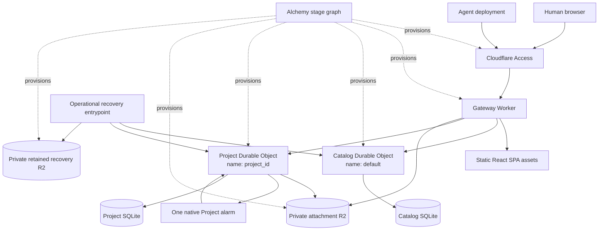
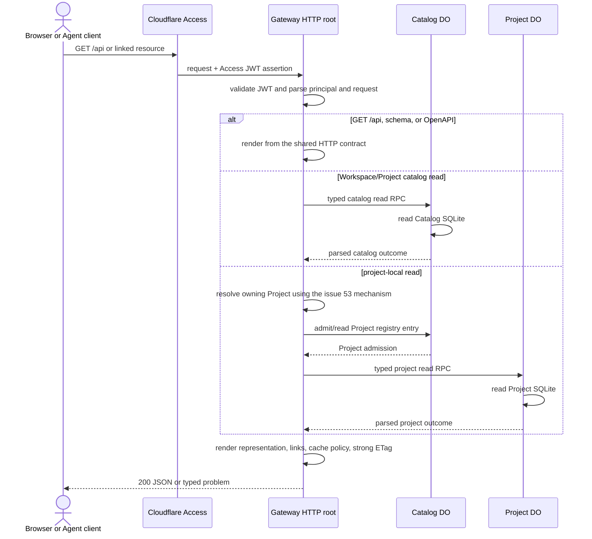
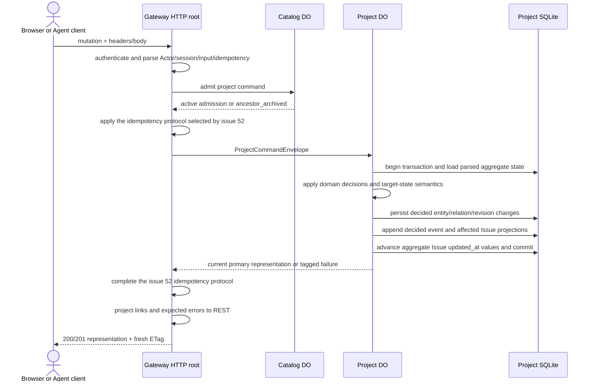
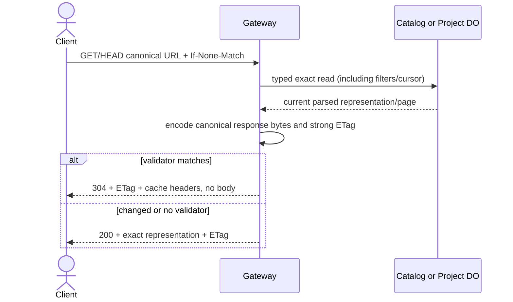
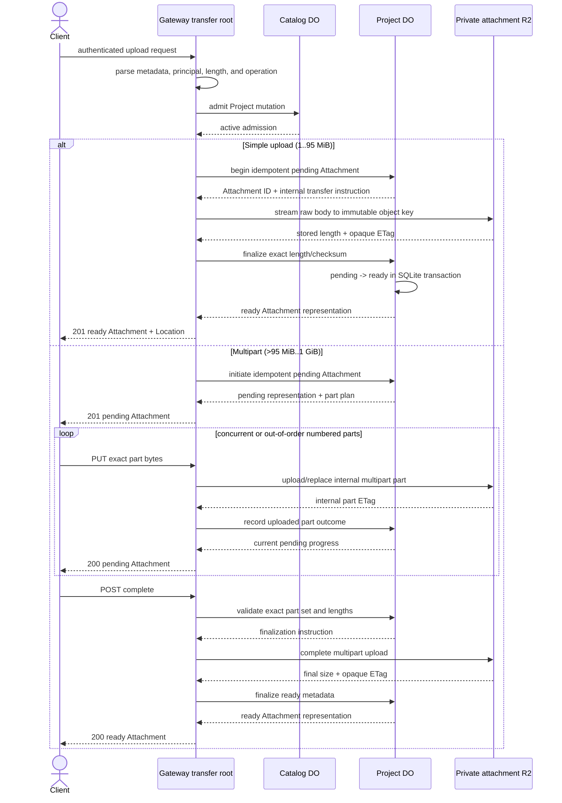
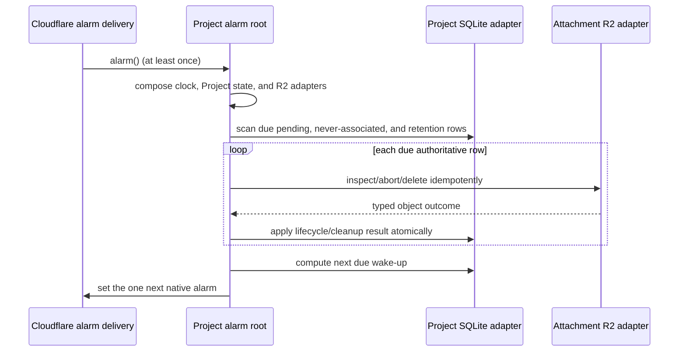

# ADR-0001: MVP system architecture

**Status:** Proposed review artifact for [#50](https://github.com/dmmulroy/overseer/issues/50). The product and topology constraints come from [#49](https://github.com/dmmulroy/overseer/issues/49); this document does not reopen them.

The public system is one Access-protected hostname. A Gateway Worker serves the static React SPA and the `/api` REST interface. The Gateway calls one singleton Catalog Durable Object and one Project Durable Object per Project through typed RPC. Project SQLite owns project-local metadata; private R2 owns file bytes, never authorization or lifecycle.

## Decision boundary

### Settled constraints

The following are fixed by #49 and are not implementation choices:

- one Gateway Worker is the only public ingress;
- one singleton SQLite Catalog Durable Object owns Workspace and Project catalog state;
- one SQLite Project Durable Object per Project owns all project-local state;
- one private attachment R2 bucket and one private retained-recovery R2 bucket exist per deployed stage;
- one native Project alarm drives Attachment reconciliation;
- Cloudflare Access authenticates the human and independently credentialed Agent deployments;
- Alchemy exclusively owns each stage's Worker, Durable Object, R2, Access, domain, and class-lifecycle resources;
- the same-origin REST interface is rooted at `/api` and the pinned Effect HTTP declaration is its single contract source;
- the browser uses ordinary conditional REST reads, not realtime or a synchronization protocol;
- transactions stop at one Durable Object.

### Local, reversible choices made by the program design

These choices may change without changing the product contract or topology:

- source directories and file names;
- whether an internal typed RPC surface uses one closed `read`/`command` union or several cohesive methods;
- SQL table and index names, migration function names, and query plans;
- Effect layer names and whether an immutable adapter is reused or constructed per invocation;
- in-memory cache eviction limits, provided the observable freshness policy remains unchanged;
- tracing provider and safe span names.

A change to public routes, domain behavior, authentication, storage ownership, client freshness, or UI direction is not a local choice. A contradiction in one of those areas requires a focused decision Issue.

### Focused contradictions

[#51](https://github.com/dmmulroy/overseer/issues/51) records one genuine contradiction exposed by this architecture. The settled mention behavior asks a qualified Issue mention in Project A to create a reciprocal backlink and one event projected onto the source and target Issues. If the target is in Project B, that requires one logical mutation across two authoritative Project Durable Objects. The settled topology forbids cross-object transactions and pseudo-transactions, and no failure/reconciliation contract exists.

This artifact does not silently choose new behavior. Same-Project Issue references remain atomic inside one Project object; Project mentions and external URLs remain source-side derived values. The cross-Project Issue case awaits #51's backlink, Timeline, and failure semantics. This does not block same-Project references or Attachment work.

[#52](https://github.com/dmmulroy/overseer/issues/52) records a second contradiction. The REST contract scopes an idempotency key to the Authenticated principal and uses the canonical target in its conflict fingerprint, while authoritative idempotency rows are partitioned between Catalog and each Project object. Independent objects cannot detect principal-global reuse. Catalog-coordinated reservation/finalization would itself need an interruption and recovery protocol across objects. Slice 2 and later project-local ordinary POSTs await #52; Catalog-only Slice 1 operations can proceed.

[#53](https://github.com/dmmulroy/overseer/issues/53) records a third contradiction. Canonical project-local Entity URLs contain only a global Entity ID, but that prefixed ULID does not identify the owning Project Durable Object. Catalog has no settled Entity-to-Project locator, namespace enumeration is unavailable for discovery, and publishing such a locator would need cross-object interruption/repair semantics. Slice 2's first canonical Issue URL and later canonical Label, Comment, Event, and Attachment URLs await #53.

## Topology



The Gateway, Catalog constructor/RPC handler, Project constructor/RPC handler, Project alarm, browser bootstrap, Attachment transfer handler, and operational recovery command are separate composition roots even when Cloudflare hosts several of them in one Worker deployment.

## Component ownership and trust

| Part | Owns | Authoritative data | Ingress | Trust boundary |
|---|---|---|---|---|
| Cloudflare Access | Admission policy and credential lifecycle | Human Allow policy, one Service Auth credential per Agent deployment, application audience | Public hostname | Establishes that a request passed Access, but the Gateway still validates the Access JWT, issuer, audience, signature, time, and identity claims. |
| Gateway Worker | Public HTTP protocol, media negotiation, Access assertion parsing, human Origin checks, Agent-session header checks, request IDs, REST projection, conditional responses, SPA/static delivery, Attachment streaming | No durable domain data | Access-protected HTTP only | Only public application ingress. Converts untrusted HTTP into parsed Overseer values and typed calls. Never trusts caller-supplied Actor fields. |
| Static React SPA | Human interaction, URL state, session-memory canonical reads, explicit local drafts | Current URL and persisted Issue/Comment drafts only; server resources are never authoritative in the browser | Gateway asset routes and authenticated `/api` calls | Browser data, IndexedDB, focus/visibility, and network state are untrusted. Human unsafe requests must have the configured exact Origin. |
| Catalog Durable Object | Workspace/Project registry, membership, Project moves, archive lifecycle, catalog admission | Workspace records, Project records and immutable Project registry, migration ledger, and any idempotency records assigned by #52 | Binding-only typed RPC from a composition root | One-object SQLite transaction boundary. It neither accepts public HTTP nor owns project-local content. |
| Project Durable Object | Project-local consistency and invariant enforcement | Issues and number counter, Labels, Comments, Revisions, Parent/Sub-issue and Blocking relations, Label assignments, Assignees, references, Timeline events/projections/positions, Attachment metadata/lifecycle, migration ledger, and any idempotency records assigned by #52 | Binding-only typed RPC and its native `alarm()` entrypoint | One Project and one SQLite transaction boundary. A Project ID selects the object; mutable names and Issue numbers never do. |
| Attachment R2 bucket | Opaque file bytes and R2 multipart mechanics | Attachment objects, internal multipart upload IDs/part ETags, final opaque object ETag | Gateway transfer adapter and Project-alarm R2 adapter only | Private binding. It has no public/custom domain, presigned URL, authorization policy, or authoritative lifecycle metadata. |
| Recovery R2 bucket | Retained logical export objects | Versioned verified export bytes and manifests | Operational recovery adapter only | Private retained binding. It is not an application datastore or attachment fallback. |
| Native Project alarm | At-least-once wake-up | No independent work queue or schedule records beyond the platform alarm timestamp | Cloudflare calls `alarm()` | A prompt to scan authoritative Attachment rows. The scan is idempotent; correctness does not depend on a single delivery. |
| Alchemy stage graph | Provisioning and class lifecycle | Encrypted deployment state and declared resource graph | Deployment command | Resource-management boundary, never a runtime domain interface. Stages have distinct hostnames, namespaces, buckets, Access applications, and data. |

## Entity and record ownership

An Entity is written only by its authoritative object. Other parts may hold identifiers, projections, immutable Actor snapshots, or cache entries but may not duplicate authority.

| Record family | Authoritative owner | Notes |
|---|---|---|
| Workspace and Project entities | Catalog SQLite | A Project move changes only Catalog membership. Its Entity ID and Project Durable Object name remain unchanged. |
| Issue, Label, Comment, and Timeline event entities | Owning Project SQLite | Project-local Issue numbers are allocated atomically from the owning Project's monotonic counter. |
| Attachment entity metadata | Owning Project SQLite | R2 contains bytes and provider metadata only. Public pending/ready/deleted lifecycle is Project state. |
| Revisions, Parent/Sub-issue, Blocking, Label assignment, Assignee, Mention/reference, and Timeline position records | Owning Project SQLite | These are values or relations, not independently identified entities. Shared events have one Entity ID and one immutable projection position on every same-Project affected Issue. Cross-Project Issue projection semantics await #51. |
| Actor and Agent-session snapshots | Owning Project SQLite on the Comment/event they attribute | The Gateway derives the Actor from Access; caller session metadata is parsed but grants no authority. |
| Attachment bytes and multipart provider records | Attachment R2 | Keys derive only from immutable Project and Attachment IDs. R2 upload IDs, keys, and part ETags never cross an application or public interface. |
| Browser canonical resources and ETags | No durable owner in the browser | Session-memory copies are disposable observations. Only explicit drafts and their base revision/context persist in IndexedDB. |
| Logical exports | Recovery R2 | Export manifests identify source object, schema version, creation time, and verification result; they do not become live authority until an explicit restore procedure. |

## Trust and admission order

Every public request follows this order before protected data is disclosed:

1. Cloudflare Access admits the request.
2. The Gateway validates the injected Access JWT itself and parses an `AuthenticatedPrincipal`.
3. For an unsafe human request, the Gateway checks the exact configured Origin. For an Agent-deployment mutation, it parses the required `Overseer-Session-Id` and optional `Overseer-Harness`.
4. The HTTP adapter parses path, query, headers, media type, and body into the operation's contract type. Authentication and parse failures are not entered into idempotency storage.
5. Project-scoped operations ask Catalog for current routing/admission state. Commands admitted after an effective archive are rejected; an already-admitted command may finish.
6. The Gateway invokes the authoritative object's typed RPC surface and projects its plain tagged outcome.

The inbound HTTP adapter owns steps 1–4's protocol/authentication parsing and final response projection. A Gateway-composed `ProjectOperations` Application Module owns Entity-owner resolution, Catalog admission, idempotency, and Project invocation for steps 5–6; `AttachmentTransfer` owns the equivalent admission and cross-store transfer sequence. Raw HTTP and bindings remain outside both modules.

Catalog admission is a guard against writes to archived ancestry, not a distributed transaction or lock. No Catalog lock is held while Project work runs.

## Important paths

### Authenticated discovery and read



The Gateway may construct a Project stub directly from a parsed Project ID only after Catalog confirms the immutable registry entry and current archive context. A canonical URL containing only a project-local Entity ID must first use the routing mechanism selected by #53. Namespace enumeration is never discovery, and this artifact does not assume a hidden locator.

### Project-local mutation and Timeline projection



A no-op performs no Revision, event, timestamp, association, or idempotent relation change. A shared graph/reference event and all of its Issue-local projection positions commit in the same Project transaction. The two abstract idempotency steps await #52 and do not imply that the Gateway itself stores state.

### Conditional read and ETag response



An ETag validates one exact representation or filtered/ordered page, including its pagination links. It is never an entity concurrency version and is never accepted as a mutation precondition.

### Attachment simple and multipart transfer/finalization



SQLite and R2 do not form a transaction. A durable pending Attachment row is the reconciliation source of work if streaming or finalization is interrupted. Provider instructions and identifiers are adapter records, not public or domain values. Completion and abort use dedicated state/part idempotency; ordinary POST initiation uses the settled `Idempotency-Key` rules.

### Alarm-driven reconciliation



Pending uploads and ready Attachments never associated with Markdown expire after seven days. Explicitly deleted bytes are restorable for thirty days. The alarm owns no independent job table and can safely repeat after interruption. Infrastructure cleanup does not invent Attachment-specific Timeline events.

## Contracts and projections

### REST contract source

One shared, exactly pinned Effect `HttpApi`/Schema declaration owns:

- every stable route, method, path/query/header/body parser, success representation, expected problem variant, and media type;
- generated OpenAPI 3.1 at `/api/openapi.json`;
- content-addressed JSON Schema 2020-12 request documents under `/api/schemas/...`;
- the generated browser and Agent-client types.

The declaration is a wire-contract module, not a domain module. It imports protocol projections built from parsed Overseer values. It does not expose Effect internals, SQL rows, Durable Object stubs, R2 records, or Cloudflare bindings.

### Internal RPC contracts

Catalog and Project RPC are private binding protocols. Each accepts a closed, schema-decoded plain request and returns a schema-decoded plain tagged outcome. The contracts use Entity IDs, domain values, `Actor`, `AgentSession`, request identifiers, and operation-specific inputs—not `Request`, `Response`, `Env`, SQL rows, Alchemy stubs, or R2 types.

A minimal cohesive surface is:

```text
Catalog RPC: read(CatalogRead) | command(CatalogCommand) | admit(ProjectId, OperationKind)
Project RPC: read(ProjectRead) | command(ProjectCommandEnvelope)
```

The unions are closed and operation-specific. They are not generic string commands or public endpoints. This small interface is justified by the two actual callers—the Gateway RPC adapter and operational tooling—and hides routing, schema evolution, migrations, and serialization. Alchemy's schemaless transport does not preserve class identity, so tagged values are decoded again at both ends.

### Idempotency scope

- The settled ordinary key scope is Authenticated principal plus key, retained for at least twenty-four hours. The fingerprint includes method, canonical target, normalized query, relevant metadata, and body; reuse on a different target conflicts.
- Catalog and Project operations must use the ownership/recovery protocol selected by #52. This architecture does not weaken the public scope to per-object keys or silently introduce a cross-object reservation workflow.
- Attachment initiation additionally binds the owning Issue. Multipart part replacement, completion, and abort use their dedicated state/part semantics.
- A replay returns the original status, body, `Location`, and `Idempotency-Replayed: true`, even if later unrelated writes changed current state.

### Expected errors

Domain and application modules return precise tagged failures. Adapters classify Access, HTTP, SQL, RPC, R2, and configuration failures before those values cross inward. RPC serializes safe plain tagged outcomes. The Gateway alone maps expected failures to RFC 9457 `application/problem+json`, preserving the stable code, request ID, retryability, field errors/details, and safe recovery links.

Unexpected defects are logged/traced with safe context and become `500`; raw SQL causes, R2 keys/upload IDs, Access assertions, service-token secrets, and unbounded caller input never appear in responses or telemetry.

### Client freshness boundary

The browser's conditional-query module owns `{ representation, etag, validated_at }` for each exact canonical URL in session memory. TanStack Router owns URLs and route lifetime, not canonical data. IndexedDB owns only explicit Issue/Comment drafts and their base revision/context.

The active Issue validates every 15 seconds and the active exact Issue-list page every 30 seconds. Only visible rendered routes poll. Completion schedules the next poll; duplicate demand coalesces; navigation cancels orphaned work. A result validated within five seconds may satisfy navigation, wake-up, or pre-mutation validation. `200` replaces representation and ETag; `304` advances only local `validated_at`. A failed validation leaves cached content readable but disables server writes. Retryable failures wait 5, 15, 30, then repeating 60 seconds and honor a longer `Retry-After`; success resets the backoff. Routine refresh stays quiet for two seconds before showing `Updating…`. Mutation success installs the returned representation before targeted conditional convergence.

## Migration and recovery responsibility

| Concern | Owner | Rule |
|---|---|---|
| Cloudflare Durable Object class creation/rename/transfer/deletion | Alchemy stage graph | Alchemy is exclusive owner. Review destructive plans; never mix hand-written class lifecycle declarations. |
| Catalog/Project SQLite schema | Each Durable Object constructor composition root and its SQLite adapter | Ordered forward-only migrations use a migration table, run under constructor-time `blockConcurrencyWhile`, and receive full `ctx.storage`. No `PRAGMA user_version`, raw transaction statements, or nested transactions. |
| Handler/layer initialization | Each Durable Object constructor | Build, migrate, and prime the long-lived Effect handler before external work. Correctness cannot depend on an eviction finalizer. |
| Routine recovery | Cloudflare per-object PITR | Maintain and test separate Catalog and Project restore procedures within the 30-day window. |
| Destructive change safety | Operational recovery composition root | Quiesce the affected object, create a versioned logical export in retained recovery R2, verify its manifest/content, then permit the destructive plan. This is operational RPC, not public REST. |
| Attachment cleanup recovery | Project alarm application module | Reconcile from durable Attachment rows; repeat safely and schedule the next due alarm. |

A Catalog export cannot atomically snapshot every Project, and no design pretends otherwise. A stage-level export is a manifest of independently quiesced and verified object exports.

## Explicitly rejected architecture

- **A second public Durable Object API:** rejected. Public REST terminates at the Gateway; Durable Objects expose binding-only typed RPC.
- **Direct browser-to-R2 access:** rejected. All upload and content delivery passes through authenticated Gateway routes; there are no public buckets, custom domains, or presigned URLs.
- **Cross-object pseudo-transactions:** rejected. Catalog admission and Project execution are separate operations. No distributed lock, compensating fiction, cross-Project relation, or cross-object join is introduced. #51–#53 must resolve references, idempotency, and canonical routing without silently assuming exceptions.
- **Public realtime/sync infrastructure:** rejected. There are no WebSockets, change-record feeds, replay sequences maintained for transport, durable client cursors, long polling, Queues, or Pub/Sub.
- **Raw runtime dependencies below composition roots/adapters:** rejected. `Env`, Cloudflare bindings, `Request`/`Response`, Durable Object state/stubs, Alchemy resource types, SQL rows/clients, and R2 records remain in runtime roots or their owning adapters.
- **Additional infrastructure:** rejected. No D1, scheduler abstraction, extra Worker, extra Durable Object, or repository-per-table persistence layer is added.
