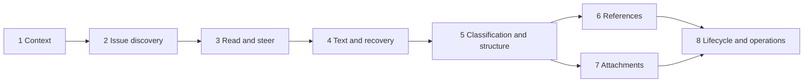

# MVP vertical-slice plan

**Status:** Review artifact for [#50](https://github.com/dmmulroy/overseer/issues/50). Implementation starts only after [system architecture](../adr/0001-mvp-system-architecture.md) and [program design](./mvp-program-design.md) review.

Every slice leaves one authenticated application runnable, crosses the relevant public ingress through authoritative persistence, and ends in a human- or Agent-client-observable capability. Files/modules in the program design arrive only when a slice needs them; there is no database, service, API, or frontend horizontal phase.

## Rules for every slice

A slice is complete only when:

- the Agent-client proof runs through the authenticated Gateway HTTP interface in local workerd;
- the human proof runs through the authenticated browser SPA when the slice has a human surface;
- all less-trusted input and persisted output at touched boundaries is parsed;
- expected failures are typed through the owning application module and projected as safe RFC 9457 problems;
- applicable links, direct representations, collection envelopes, idempotency, ETags, and no-op behavior follow the shared contract for the operations introduced;
- the UI added by the slice works at desktop and mobile widths, in light/dark/system themes, with keyboard/focus behavior and automated accessibility checks appropriate to that UI;
- retry/freshness behavior introduced by the slice uses production-shaped outcomes rather than a later test-only architecture;
- strict typecheck, production build, focused tests, local-workerd tests, browser tests, and accessibility checks for the accumulated application are clean;
- the stage remains deployable and previously completed demonstrations still pass.

Accessibility, responsive behavior, errors, observability, and migrations are cumulative acceptance criteria, not work deferred to the final slice.

## Contract carry-forward policy

Each slice extends the one Effect HTTP declaration and only the closed domain/RPC cases it needs. A slice may add fields/relations that the public contract already specifies; it may not publish placeholder routes, generic mutation endpoints, empty repositories, speculative ports, or stubs for later slices. Content-addressed request schemas and OpenAPI regenerate from the declaration on every contract change.

The internal data schema follows expand/contract when necessary. Forward migrations preserve all prior demonstrations. No slice gains permission to change a settled route or meaning merely because only part of the MVP has shipped.

## Ordered slices

### 1. Authenticated discovery and Workspace/Project context

**User-visible checkpoint:** An authenticated human or Agent client can start at `/api`, create and read Workspaces and Projects, and select persistent Workspace/Project context in the SPA.

**Prerequisites**

- architecture and program design accepted;
- pinned Effect/Cloudflare compatibility fixture available as a gate;
- Alchemy stage names, hostname, Access audience/issuer, human test identity, and Agent-deployment test credential configured;
- exact Effect `4.0.0-beta.98` and Alchemy `2.0.0-beta.62` pins.

**Vertical scope**

- Alchemy stage graph for one Worker deployment, Access application/policies, Catalog and Project classes, static assets, and isolated stage configuration; Attachment and retained-recovery buckets are added only in the slices that first use them;
- Gateway, Catalog constructor/migrations/RPC, and browser composition roots;
- Access JWT parsing, human Origin checks, Agent-session metadata parser, request IDs, common media/problem projection;
- `GET /api`, `/api/schemas`, content-addressed schemas, and `/api/openapi.json`;
- Workspace create/list/read/rename and Project create/list/read/rename/move needed to establish context;
- Catalog idempotency and strong ETags/HEAD/304 for introduced reads;
- SPA shell, desktop Workspace/Project rail, mobile Project selector, empty/loading/stale/error states, and context URLs;
- owned light/dark/system preference control, persisted preference, live system-preference changes, and a pre-render theme script that avoids a wrong-theme flash.

Archive/restore is deferred to the lifecycle slice so this checkpoint stays focused on active context. The Project Durable Object is initialized and compatibility-tested, but no project-local table or empty forwarding layer is added before Slice 2 needs it.

**Contracts carried forward**

- `EntityId`, Workspace/Project name, `AuthenticatedPrincipal`, `Actor`, `AgentSession`, `IdempotencyKey`, Link, Problem, ETag, page/cursor foundations;
- Catalog `read`, `command`, and `admit` RPC cases required above;
- discovery, Workspace, Project, schema, and OpenAPI REST routes.

**Primary test seams**

- Agent client: authenticated Gateway HTTP with real Catalog SQLite in local workerd;
- human: authenticated SPA shell against that Gateway.

**Acceptance demonstration**

1. An Agent client with a test Agent-deployment Access identity requests `/api`, follows `workspaces`, follows its create schema, and creates “Personal” with an idempotency key.
2. Replaying that request returns the original `201` result with `Idempotency-Replayed: true`; conflicting reuse returns the typed conflict.
3. The Agent client creates “Overseer,” follows canonical links, moves it to a second Workspace, and proves its Project URL/ID did not change.
4. `If-None-Match` on an unchanged Project returns `304`; OpenAPI and schema links resolve with their specified media/cache behavior.
5. The human opens the SPA, sees the same Workspaces/Project, changes context on desktop and mobile, reloads, and remains on a valid URL-backed context with no accessibility or console errors.
6. The human selects light, dark, and system preferences, reloads without a wrong-theme flash, and observes a live operating-system theme change while `system` is selected.

**Runnable state:** The deployed app has authenticated discovery and a useful empty Project context. No unauthenticated bypass or direct Durable Object surface exists.

---

### 2. Issue discovery

**User-visible checkpoint:** The human and Agent clients can create numbered Issues and find the relevant page with the settled structured filters; the SPA provides the dense filtered Issue list.

**Prerequisites**

- Slice 1 accepted;
- one active Project can be admitted by Catalog;
- [#51](https://github.com/dmmulroy/overseer/issues/51) has selected qualified cross-Project Issue-mention write semantics before Issue bodies begin accepting that syntax;
- [#52](https://github.com/dmmulroy/overseer/issues/52) has selected an implementable ownership/recovery protocol for principal-global idempotency before the first Project-owned ordinary POST ships;
- [#53](https://github.com/dmmulroy/overseer/issues/53) has selected routing/repair semantics for canonical project-local Entity URLs before `/api/issues/{issue_id}` ships.

**Vertical scope**

- Project constructor-time schema/migration and real `Project` application/RPC/state adapters;
- atomic per-Project Issue number allocation starting at 1, immutable/gapped/non-reused semantics;
- Issue creation from title and optional Markdown body, including initial title/body Revisions, `issue_created` event, immutable attribution, and first Timeline position in the same transaction;
- write-side Markdown reference extraction and current-reference reconciliation required by Issue-body creation, including same-Project backlink/event plans and the #51-selected qualified behavior;
- the basic authenticated Issue reference collection read needed to prove those writes through the Gateway; Slice 6 adds its full filters and human navigation;
- canonical Issue read needed for create/self links and Project-number alias read;
- Project Issue listing with the full specified filter vocabulary, defaults, enum sorts/directions, opaque bound keyset cursors, default 50/cap 100, and no totals;
- bounded Issue summaries and state-applicable HATEOAS links;
- exact-page strong ETags and `If-None-Match`/HEAD;
- SPA list route with discrete State, Assignee, Label, and Readiness controls, URL-owned filter state, dense rows, pagination links, and Issue creation affordance.

Filters whose underlying data has not been introduced yet still parse according to the final contract and return the correct empty/result semantics; the slice does not add Label or relationship mutation placeholders.

**Contracts carried forward**

- Issue ID/number/title/body/state/lifecycle/summary types;
- the write-side Mention/reference extraction and reconciliation plan required by Issue bodies;
- Project Issue create/read/list and basic Issue-reference read RPC/REST cases plus the #53-selected canonical owner-routing contract;
- parsed Issue filter/sort/cursor types and exact collection page;
- conditional list query atom and 30-second visible-route cadence.

**Primary test seams**

- Agent client: authenticated Project Issue REST collection and canonical reads in local workerd;
- human: SPA Issue-list route against the same Gateway.

**Acceptance demonstration**

1. An Agent client creates at least 101 Issues, retries one create, and observes unique monotonic project-local numbers without duplication.
2. It follows next/previous links rather than editing cursors, filters by state/assignee status/number, and receives actionable errors for a cursor rebound to different filters or unknown/contradictory parameters.
3. It reads `/api/projects/{project_id}/issues/{number}` and receives the canonical representation whose `self` is `/api/issues/{issue_id}`.
4. It validates an unchanged exact page to `304`, mutates the dataset with a new Issue, and observes a changed page ETag.
5. An Issue created with a same-Project mention exposes the current outgoing reference through its authenticated reference collection, and the target exposes the reciprocal incoming reference; unresolved text creates neither.
6. The human applies list filters, follows a row to the focused route and Back, and recovers the exact list URL/filter/page context at desktop and mobile widths.

**Runnable state:** The app is a useful authenticated issue inbox even though detail steering and narrative history are not yet present.

---

### 3. Issue reading and simple steering

**User-visible checkpoint:** A focused Issue can be read, closed/reopened, claimed/released/reassigned, and understood through its current action links and Timeline.

**Prerequisites**

- Slice 2 accepted;
- canonical Issue resources and filtered list convergence exist.

**Vertical scope**

- full Issue representation, relationship counts/navigation placeholders only where a real readable collection now exists, and current applicable action links;
- close/reopen and guarded claim/release/reassign target-state commands, including no-ops;
- immutable Actor/Agent-session attribution and closed Timeline event vocabulary for these changes;
- atomic event creation, Issue-local Timeline position allocation, and aggregate `updated_at` behavior;
- Timeline/event reads and cursor paging for introduced event kinds;
- active Issue detail sentinel polling every 15 seconds and changed-sentinel revalidation of currently rendered Timeline pages;
- focused SPA reading brief and persistent steering rail (below the brief on mobile), discovered actions, quiet structured-change digest, retry/read-only states, and deterministic optimism/rollback for steering.

**Contracts carried forward**

- `CommandAttribution`, Assignee, Issue action, Timeline event/projection/position types;
- close/reopen/claim/release/reassign command cases and action-specific errors;
- Issue detail, Timeline, and Event REST routes;
- conditional detail query, mutation preflight, optimism, and targeted convergence modules.

**Primary test seams**

- Agent client: authenticated Issue action and Timeline REST interface;
- human: focused SPA Issue route and steering rail.

**Acceptance demonstration**

1. An Agent client reads an open unassigned Issue, follows `claim`, and gets the current full representation with `release`/`reassign` replacing `claim`.
2. A second stale claim gets `409 action_not_applicable`, the current Issue, and a safe `reassign` recovery link. A deliberate reassign succeeds.
3. Repeating achieved close/release target states is a no-op: no timestamp advance and no extra Timeline event. Replaying a POST key returns its original result.
4. Timeline reads show immutable Actor and Agent-session snapshots in true Issue-local order, including reference events produced by Issue bodies created in Slice 2; the owning Issue and visible list converge after each command.
5. In the browser, keyboard and pointer users steer the Issue, see optimistic rollback on a retryable failure without misleading action links, and observe an external Agent-deployment change through ordinary polling.

**Runnable state:** Overseer supports the minimum read-and-steer loop for human and Agent-client coordination.

**Review batch gate:** Stop here for architecture/code/behavior review before assigning dependent Slices 4–6 to an implementation agent. The first three slices are the maximum recommended initial batch.

---

### 4. Text contribution and draft recovery

**User-visible checkpoint:** Humans and Agent clients can revise Issue text and contribute Comments while retaining history; human drafts survive refresh and resolve divergence explicitly.

**Prerequisites**

- Slice 3 accepted;
- Actor/session attribution, Timeline, conditional detail query, and command convergence are proven.

**Vertical scope**

- field-scoped Issue title/body PATCH and Comment create/edit/delete/restore, with every text create/edit/delete/restore atomically reconciling its current Mention/reference set through the write-side capability introduced in Slice 2;
- immutable owner-local title/body/Comment Revisions, monotonic numbers, exact no-op behavior, and revision reads/pages;
- Comment Timeline items interleaved with events by permanent Issue-local position;
- Markdown rendering/composition using the settled limits and no raw Attachment association yet;
- application-owned IndexedDB drafts with parsed records and base Revision/context;
- pre-write five-second validation, inline divergence with full current/draft versions and actor/time/revision context, explicit keep-current/save-draft choice, and no silent merge;
- returned-representation installation and targeted Issue/Timeline/list convergence;
- stale cached content remains readable, server writes disable after failed validation, local draft editing remains available.

**Contracts carried forward**

- Revision and Comment domain/RPC/REST cases;
- field-scoped patch schemas and no-op outcomes;
- Comment and Revision representations/routes;
- Drafts port/IndexedDB adapter and divergence command state.

**Primary test seams**

- Agent client: authenticated Issue/Comment mutation plus Revision/Timeline reads;
- human: Issue narrative/composer/editor through the authenticated SPA.

**Acceptance demonstration**

1. An Agent client edits only the body while another client edits only the title; both committed changes survive and have independent Revision histories.
2. Identical saves create no Revision, Timeline event, association change, or timestamp advance.
3. The Agent client creates, edits, deletes, and restores a Comment; the tombstone keeps identity/attribution/position, hides text/revisions while deleted, and returns to the same Timeline position.
4. A human begins a draft, an Agent client commits newer text, and pre-write validation shows both full versions inline. Reload preserves the draft. Choosing either recovery action has the documented result without silent merging or loss.
5. A forced validation failure leaves cached narrative readable, says when it was last validated, offers Retry, disables server writes, and still permits local draft editing.

**Runnable state:** The app supports durable narrative work and safe ordinary concurrent editing.

---

### 5. Classification and work structure

**User-visible checkpoint:** Issues can be classified with Labels and composed into ordered Parent/Sub-issue and independent Blocking DAGs, with readiness visible in lists and detail.

**Prerequisites**

- Slice 4 accepted;
- project-local transactions and detail/list convergence are stable; this slice introduces and proves atomic same-Project multi-Issue Timeline projection.

**Vertical scope**

- Label create/read/edit/delete/restore and preserved inactive Issue assignments;
- Label assignment PUT/DELETE;
- one Parent per Issue, complete-set ordered Sub-issue reorder, and inactive preserved hierarchy semantics;
- directed “this Issue is blocked by that Issue” PUT/DELETE and reciprocal read-only blocking projection;
- independent same-Project DAG checks over all currently preserved edges, self/duplicate/cross-Project rejection, active/inactive reasons, and readiness derivation; Issue-deletion effects join the same checks in Slice 8 when that public lifecycle exists;
- one shared event ID projected atomically to every affected Issue, with each Issue's own permanent Timeline position;
- list filter membership/order convergence for Label, Parent/root, blocking status, state, assignee, and readiness;
- detail Label controls and visibly distinct hierarchy versus Blocking relation views.

**Contracts carried forward**

- Label and relation domain values/status/inactive reasons;
- pure DAG and complete-set reorder decisions;
- Label/Parent/Sub-issue/Blocked-by RPC and REST cases;
- relation-specific problem details and affected-query convergence keys.

**Primary test seams**

- Agent client: authenticated Label and relationship REST resources, including later reads from every affected Issue;
- human: Issue detail relation/classification controls and filtered list.

**Acceptance demonstration**

1. An Agent client creates Labels, assigns them, filters Issues with repeated `label_id` under `any` and `all`, deletes/restores a Label, and observes assignment preservation with inactive/active status.
2. It creates ordered Sub-issues, reorders only the complete preserved set, and receives `relation_set_changed` plus the current order for a stale set.
3. It proves Parent and Blocking cycles are checked separately and cross-Project/self/duplicate writes fail with stable problem codes.
4. Closing/reopening a blocker inactivates/reactivates readiness without deleting the relation. Every affected Issue receives the same event ID at its own Timeline position.
5. The human distinguishes hierarchy from Blocking, changes Labels/relations with keyboard-accessible controls, and sees list readiness/filter membership converge without Project-wide refetch.

**Runnable state:** Generic primitives now compose into practical work structure without introducing a board, workflow type, or Wayfinder resource.

---

### 6. Markdown references

**User-visible checkpoint:** Current Issue/Comment Markdown derives navigable same-Project, qualified Project-number, Project, canonical Overseer URL, and external URL references with reciprocal Issue visibility.

This is split from Attachments because reference reconciliation is independently useful and testable, while combining both would make one review carry two distinct parsers and recovery models.

**Prerequisites**

- Slice 5 accepted;
- Issue/Comment text revisions and atomic same-Project multi-Issue Timeline projection exist;
- Catalog can resolve immutable Project registry context without cross-object transactions;
- [#51](https://github.com/dmmulroy/overseer/issues/51) has settled whether qualified cross-Project Issue mentions create backlinks/events and what failure semantics apply. Same-Project references, Project mentions, and external URLs can proceed independently if #51 is still open, but the slice cannot be accepted as complete.

**Vertical scope**

- publish the reference collection, filters, links, ETags, and human navigation over reference state already maintained by all earlier Issue/Comment text writes;
- complete and expose Markdown-aware extraction excluding code and escaped content;
- same-Project `#number`, qualified Project-number, Project, canonical Overseer URL, and external URL resolution according to the settled contract and #51;
- source-item/target deduplication, outgoing/incoming Issue references where applicable, outgoing Project/URL references, and current-state reconciliation on text save;
- atomic project-local backlinks and shared reference-event projections for same-Project Issue targets;
- the #51-selected cross-Project behavior, without a cross-object pseudo-transaction;
- unresolved text remains literal Markdown; no fetched metadata or URL availability checks;
- reference collection filters/order/ETags and human narrative/reference navigation;
- a migration assertion/compatibility check proving every retained pre-Slice-6 text source was already processed by the write-side reconciler; no synthetic late Timeline events or silent manual-edit backfill is permitted.

Project mentions remain source-side links. Qualified Issue mentions must follow #51; this plan neither assumes a reciprocal cross-object write nor weakens the settled ban on cross-object pseudo-transactions.

**Contracts carried forward**

- Mention/reference value family and reconciliation plan;
- Catalog resolution read needed for qualified Project identity;
- Project reference command/read cases and REST collection;
- typed reference projections and affected-query convergence.

**Primary test seams**

- Agent client: text mutation followed by authenticated reference and Timeline REST reads;
- human: rendered Markdown and reference navigation in Issue detail.

**Acceptance demonstration**

1. Reference reads expose the expected current set and Timeline history for Issue bodies and Comments committed in Slices 2–4 before the read interface existed, proving no current-text backfill gap.
2. An Agent client saves Markdown containing valid, repeated, unresolved, escaped, and code-contained references and observes exactly the independently expected current reference set.
3. Editing the source reconciles additions/removals atomically with the new Revision; one source/target pair appears once despite repeated text.
4. Same-Project reciprocal Issue views and shared Timeline events agree; qualified cross-Project Issue text demonstrates the exact #51 outcome and does not create a forbidden cross-object pseudo-transaction.
5. Exact filtered reference pages validate with ETags and expose no mutation links or invented Entity IDs.
6. The human follows rendered internal/external references while unresolved text remains ordinary Markdown and keyboard/focus behavior stays intact.

**Runnable state:** Narrative text connects work through derived generic references without adding a link-management workflow.

---

### 7. Private Attachments

**User-visible checkpoint:** Humans and Agent clients can transfer, finalize, associate, deliver, delete, restore, and recover private Attachment bytes through authenticated Overseer routes.

**Prerequisites**

- Slice 5 accepted; Slice 6's qualified cross-Project decision is not a prerequisite;
- Slice 4's Issue/Comment text pipeline can reconcile canonical Attachment links atomically (reuse Slice 6's Markdown parser if available, but do not require its acceptance);
- this slice adds the first private attachment R2 bucket/binding; the Project class already supports its native alarm entrypoint without a separate scheduler resource;
- transfer limits are supported by the selected deployed Worker plan.

**Vertical scope**

- Attachment metadata/entity lifecycle and immutable ID-derived object identity;
- authenticated simple streaming through 95 MiB and multipart flow above it through 1 GiB with 64 MiB parts;
- exact length/part-set checks, replacement semantics, initiation/replay conflicts, completion and abort;
- ready-to-paste Markdown snippets and owning-Issue-only current Markdown association validation/reconciliation;
- private ready-only content delivery, HEAD/ETag/304, single ranges/206, safe inline allowlist, forced download otherwise, `nosniff`, and no R2 identifiers;
- in-use deletion constraints including deleted Comment latest revisions; thirty-day explicit-delete restoration and seven-day pending/never-associated expiry;
- alarm-driven idempotent reconciliation and typed retry/resume problems;
- contribution-owned Attachment UI in the narrative composer, progress/resume/finalization, association, download, and named delete/restore recovery.

**Contracts carried forward**

- Attachment, transfer plan, part, object identity, retention, and association values;
- AttachmentTransfer/AttachmentObjects/Reconciliation interfaces and R2 adapters;
- Attachment RPC/REST/content routes and error variants;
- native alarm root and next-wake scheduling.

**Primary test seams**

- Agent client: authenticated Attachment metadata/transfer/content HTTP interface in representative local workerd/R2;
- human: SPA composer and Attachment contribution UI;
- supplement: alarm and range mechanics in the representative runtime, never a module mock.

**Acceptance demonstration**

1. An Agent client performs a simple upload and receives one ready immutable Attachment with canonical content/snippet; wrong actual length fails safely and leaves reconcilable state.
2. It initiates a multipart upload, sends parts concurrently/out of order, replaces one part, gets missing-part details from premature completion, then completes to the exact final size without seeing R2 IDs/ETags.
3. Ready content supports authenticated HEAD, conditional `304`, valid single range `206`, safe-inline versus forced-download policy, and immediate unavailability after deletion.
4. Markdown in the owning Issue associates the ready Attachment; pending/deleted/cross-Issue references fail atomically. Deletion lists every live/deleted-Comment blocker. Named restore works only inside its deadline.
5. A deliberately interrupted pending transfer and an expired never-associated Attachment are reconciled by repeated alarm delivery with the same final public state.
6. The human uploads from the composer, inserts the snippet, observes progress/recovery accessibly on mobile and desktop, and can download/delete/restore through discovered actions.

**Runnable state:** Files are useful and private without public buckets, presigned URLs, or an attachment-specific workflow engine.

**Review batch gate:** Review Slices 4–7 in batches of at most two or three. A recommended sequence is 4–5, then 6–7 because each pair shares one convergence/reconciliation concern.

---

### 8. Lifecycle and operational completion

**User-visible checkpoint:** Archive/restore and tombstone recovery work consistently across all surfaces, and a deployed stage can be migrated, exported, verified, and restored without bypassing the architecture.

**Prerequisites**

- Slices 1–7 accepted;
- every authoritative record and surface has its final lifecycle behavior;
- production-equivalent stage and retained recovery bucket are available for a recovery drill.

**Vertical scope**

- Workspace/Project archive/restore, default-list omission, direct read-only traversal, inherited command admission, and Project movement restrictions;
- Issue delete/restore and complete tombstone behavior across Comments, relations, references, Attachments, list/detail/Timeline surfaces;
- Label/Comment/Attachment lifecycle edge cases not already completed by their slices;
- final production-equivalent retry/freshness/error matrix and no-op/idempotency audit across all introduced operations;
- migration and class-lifecycle guardrails, per-object 30-day PITR runbook, versioned logical Catalog/Project exports to retained recovery R2, manifest verification, and restore drill;
- deployed-stage verification of Access, stage isolation, private buckets, alarms, static SPA/API routing, OpenAPI/schema publication, and no forbidden resources;
- accumulated accessibility/responsive/theme/keyboard/reduced-motion/zoom/coarse-pointer audit and final browser console/network cleanliness.

This slice does not postpone basic lifecycle design or accessibility from earlier work. It proves cross-surface completeness now that every resource exists and exercises the operational path that cannot be demonstrated meaningfully against a partial schema.

**Contracts carried forward**

- final archive/tombstone action/read cases and inherited access projections;
- logical export manifest and operational RPC types, private to recovery tooling, plus the first retained-recovery R2 bucket/binding;
- no new public infrastructure or workflow contract.

**Primary test seams**

- Agent client: complete authenticated Gateway lifecycle/error contract in local workerd;
- human: complete authenticated SPA lifecycle/recovery behavior;
- operations: deployed Alchemy stage plus private operational export/restore command and independent post-restore Gateway observations.

**Acceptance demonstration**

1. The human archives a Workspace. It and descendants disappear from defaults but remain directly navigable read-only; a descendant command returns `ancestor_archived` with the blocking container/restore link. Restore re-enables commands without changing descendant state.
2. The human deletes/restores an Issue and observes preserved number, Comment/Attachment ownership, relation inactivity/reactivation, root behavior while a Parent is deleted, and no cascade to Sub-issues.
3. The full expected-error matrix proves authentication/origin/session ordering, media negotiation, actionable recovery links, retryability/Retry-After, stale readable browser behavior, and absence of secrets/provider identifiers.
4. A forward migration runs under constructor priming in reconstructed Catalog and Project objects. A deliberately interrupted request cannot own initialization, and existing data remains observable through the Gateway.
5. Operators quiesce and export one Catalog and representative Projects, verify manifests in retained recovery R2, perform separate PITR/logical restore drills, and confirm restored resources through authenticated REST and SPA reads. No claim of a cross-object atomic snapshot is made.
6. The deployed resource inventory contains only the agreed Worker, two Durable Object classes, private attachment/recovery R2, Access resources, domain, and native alarms—no D1, Queue, Pub/Sub, scheduler table/framework, extra Worker, or public Durable Object route.
7. Final browser checks cover desktop/mobile, light/dark/system, keyboard/focus-heavy overlays, zoom/reflow, reduced motion, coarse pointer, and all modal states with clean accessibility automation and no horizontal overflow.

**Runnable state:** The complete MVP is deployable, recoverable within its stated limits, and reviewable through the same Agent-client and human seams used throughout implementation.

## Dependency summary

The order avoids speculative infrastructure:

- Catalog and runtime exist before Project content.
- Issue identity/list pages exist before detail actions.
- Timeline attribution exists before text contribution.
- text/Revisions exist before derived references or Attachment associations, while reference and Attachment slices remain independently runnable;
- multi-Issue event projection exists before graph/reference reconciliation;
- Attachment and retained-recovery R2 resources appear only with their end-to-end transfer and recovery slices;
- complete lifecycle/recovery is proven only after every resource can participate.

## Review cadence

- Review system architecture, then program design, before Slice 1.
- Review each slice's Gateway and browser demonstration before beginning a dependent slice.
- Assign no more than one to three slices to an implementation agent before a human architecture/code/behavior review.
- Recommended batches: **1–3**, **4–5**, then **6** and **7** independently (or together after #51), then **8** alone.
- Green tests are necessary evidence, not acceptance by themselves. Review current interfaces, module depth, raw dependency containment, deployed resource inventory, and the actual human and Agent-client behavior at every gate.
