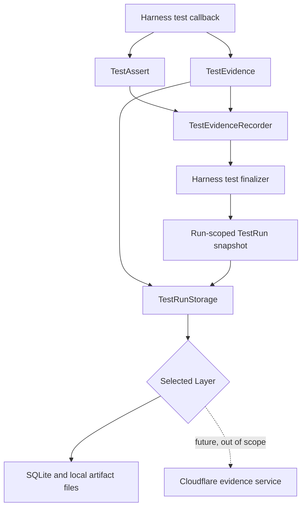
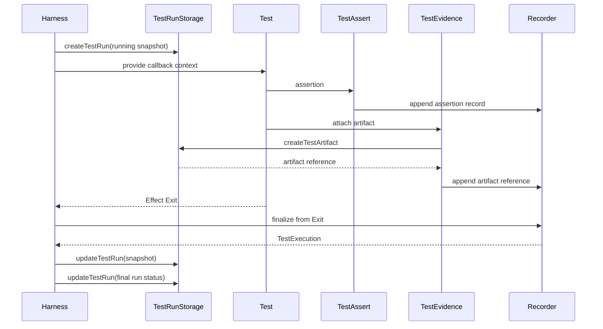

# Evidence, Assertion, and Recording Technical Specification

Status: implemented through local persistence and complete E2E migration; the evidence viewer remains future work.

This specification defines Overseer's end-to-end test evidence system from the test-authoring API through assertion recording, artifact attachment, test-run aggregation, and backend persistence. It intentionally defines a comprehensive assertion vocabulary up front. The vocabulary is not closed: future operators may be added when they provide clearer evidence than the existing operators.

## Goals

- Track every registered test and every assertion that actually executes.
- Preserve ordinary fail-fast assertion behavior.
- Give every assertion a required human-readable description.
- Record actual and expected values automatically without adding serialization concerns to test code.
- Allow tests and future browser, terminal, API, and MCP surfaces to attach screenshots, videos, files, text, and JSON.
- Expose `assert` and `evidence` through the existing extensible harness callback context.
- Persist complete test-run snapshots and artifacts through one CRUD-oriented storage capability.
- Support local storage now while preserving a backend-neutral contract that could support Cloudflare-backed storage later without changing test authoring.
- Keep Effect service constructors local to their owning service modules; runtime modules import Layers and yield services.

## Non-goals

- Assertion-level durability after an ungraceful process crash.
- Redaction or secret filtering in the initial implementation.
- A schema parameter in assertion call sites.
- Property testing, shrinking, or repeated generated infrastructure scenarios.
- Promise-oriented `resolves` and `rejects` assertions.
- Soft assertions that continue after a failed guarantee.
- A plugin API for arbitrary third-party matchers in the initial implementation.
- A production Overseer endpoint used only for test evidence.
- Implementing a Cloudflare evidence service or Cloudflare-backed `TestRunStorage` in the initial scope. The initial implementation documents that extension point but builds only local storage.

## Authoring API

```ts
harness.test("a Workspace can be renamed", ({ assert, client, evidence, fixtures }) =>
  Effect.gen(function* () {
    const scenario = fixtures.scenarios.workspaceRename.make();

    const created = yield* client.overseer.createWorkspace({
      payload: { name: scenario.initialName },
    });

    const renamed = yield* client.overseer.renameWorkspace({
      params: { workspaceId: created.id },
      payload: { name: scenario.renamedName },
    });

    assert.equal("Workspace has its renamed value", renamed.name, scenario.renamedName);

    yield* evidence.attachJson({
      name: "renamed-workspace",
      value: renamed,
    });
  }),
);
```

```text
OverseerTestContext
├── assert       synchronous and bounded Effectful assertions
├── client       authenticated Overseer API client
├── evidence     explicit artifact attachments
└── fixtures     deterministic values, models, and scenarios
```

Conceptual context contract:

```ts
interface OverseerTestContext {
  readonly assert: ITestAssert;
  readonly client: IOverseerApiClient;
  readonly evidence: ITestEvidence;
  readonly fixtures: IFixtureRegistry;
}
```

The harness yields the underlying Effect services and passes their service values through this object. Test authors do not yield those services individually.

## Runtime architecture



```text
OverseerTestHarness
├── run-scoped services
│   ├── OverseerApiClient
│   ├── FixtureRegistry
│   └── TestRunStorage
├── run-scoped TestRun snapshot coordinator
└── per test execution
    ├── fresh TestEvidenceRecorder
    ├── fresh TestAssert
    ├── fresh TestEvidence
    ├── callback context
    └── finalizer that commits the completed test snapshot
```

## Assertion execution semantics

```text
assertion invoked
├── reserve the next assertion sequence number
├── capture start time
├── execute the comparison against original runtime values
├── encode recording values best-effort
├── comparison passed
│   ├── append Passed assertion record
│   └── return normally
└── comparison failed
    ├── append Failed assertion record
    ├── retain the original AssertionError
    └── throw the original AssertionError
```

Assertions compare original values. They never compare serialized values.

A failed assertion remains fail-fast:

```text
assertion 0 passes   → recorded
assertion 1 passes   → recorded
assertion 2 fails    → recorded, then throws
assertion 3          → never executes and is not recorded
```

The test finalizer runs for success, typed failure, defect, timeout, and interruption. It persists every assertion accumulated before the test exited.

## Required assertion descriptions

Every assertion takes a nonempty description as its first argument:

```ts
assert.equal("renaming applies the requested Workspace name", renamed.name, renamedName);
```

The description states the product guarantee. Generated fallback text such as `expected values to match` is not an acceptable substitute.

## Assertion recording model

Every assertion shares this envelope:

```ts
interface TestAssertionRecord {
  readonly id: TestAssertionId;
  readonly testExecutionId: TestExecutionId;
  readonly sequence: number;
  readonly groupPath: ReadonlyArray<string>;
  readonly description: string;
  readonly startedAt: DateTime.Utc;
  readonly durationMs: number;
  readonly operation: TestAssertionOperation;
  readonly outcome: TestAssertionOutcome;
}

type TestAssertionOutcome =
  | { readonly _tag: "Passed" }
  | {
      readonly _tag: "Failed";
      readonly error: RecordedAssertionError;
    };
```

`TestAssertionOperation` is a tagged union. Each assertion method owns one operation variant containing only the fields meaningful to that operator.

Example pass:

```json
{
  "id": "assertion_test-01_0",
  "testExecutionId": "test-execution_01",
  "sequence": 0,
  "groupPath": [],
  "description": "Workspace has its renamed value",
  "startedAt": "2026-08-17T14:22:31.441Z",
  "durationMs": 0,
  "operation": {
    "_tag": "Equal",
    "actual": "Renamed Workspace",
    "expected": "Renamed Workspace"
  },
  "outcome": {
    "_tag": "Passed"
  }
}
```

Example failure:

```json
{
  "id": "assertion_test-01_0",
  "testExecutionId": "test-execution_01",
  "sequence": 0,
  "groupPath": [],
  "description": "Workspace has its renamed value",
  "startedAt": "2026-08-17T14:22:31.441Z",
  "durationMs": 1,
  "operation": {
    "_tag": "Equal",
    "actual": "Initial Workspace",
    "expected": "Renamed Workspace"
  },
  "outcome": {
    "_tag": "Failed",
    "error": {
      "name": "AssertionError",
      "message": "Workspace has its renamed value",
      "stack": "AssertionError: Workspace has its renamed value..."
    }
  }
}
```

## Assertion value recording

Assertion call sites never receive or supply a Schema.

```ts
assert.deepEqual(description, actual, expected);
```

The recorder converts arbitrary assertion values to `Schema.Json` under the covers using one best-effort encoder. The initial implementation should evaluate `Schema.Defect({ includeStack: true })` for this boundary. Its lossiness is acceptable because encoding is diagnostic and never determines assertion success.

```text
comparison
  original runtime values

recording
  best-effort JSON values
  nested plain objects and arrays remain naturally readable
  Errors retain useful diagnostic fields
  unsupported values may become formatted strings
```

Encoding failure must not change a passing comparison into a failed assertion. The encoder falls back to a stable inspected string when necessary.

The initial implementation does not add custom path metadata, schema-aware equivalence, custom structural diffing, or cyclic object reconstruction. Those features may be added behind the same assertion API if real evidence demonstrates a need.

## Complete assertion API

The interface is comprehensive but extensible. Adding a future assertion requires adding its method, operation variant, implementation, tests, and viewer rendering. Existing methods are not a permanent ceiling.

### Equality

```ts
interface ITestAssert {
  readonly equal: <A>(description: string, actual: A, expected: A) => void;
  readonly notEqual: <A>(description: string, actual: A, unexpected: A) => void;
  readonly deepEqual: <A>(description: string, actual: A, expected: A) => void;
  readonly notDeepEqual: <A>(description: string, actual: A, unexpected: A) => void;
}
```

| Method         | Semantics                              | Recorded operation                             |
| -------------- | -------------------------------------- | ---------------------------------------------- |
| `equal`        | strict equality                        | `{ _tag: "Equal", actual, expected }`          |
| `notEqual`     | strict inequality                      | `{ _tag: "NotEqual", actual, unexpected }`     |
| `deepEqual`    | strict recursive structural equality   | `{ _tag: "DeepEqual", actual, expected }`      |
| `notDeepEqual` | strict recursive structural inequality | `{ _tag: "NotDeepEqual", actual, unexpected }` |

### Allowed outcomes

```ts
interface ITestAssert {
  readonly oneOf: <A>(description: string, actual: A, expected: ReadonlyArray<A>) => void;

  readonly deepOneOf: <A>(description: string, actual: A, expected: ReadonlyArray<A>) => void;
}
```

| Method      | Semantics                         | Recorded operation                        |
| ----------- | --------------------------------- | ----------------------------------------- |
| `oneOf`     | strictly equals one allowed value | `{ _tag: "OneOf", actual, expected }`     |
| `deepOneOf` | deeply equals one allowed value   | `{ _tag: "DeepOneOf", actual, expected }` |

These operators are the preferred way to assert legal final outcomes of concurrent operations without assuming request arrival order.

### Boolean and presence

```ts
interface ITestAssert {
  readonly isTrue: (description: string, actual: boolean) => void;
  readonly isFalse: (description: string, actual: boolean) => void;

  readonly isDefined: <A>(description: string, actual: A | null | undefined) => asserts actual is A;

  readonly isUndefined: (description: string, actual: unknown) => void;
  readonly isNull: (description: string, actual: unknown) => void;

  readonly instanceOf: <A>(
    description: string,
    actual: unknown,
    expected: abstract new (...args: never[]) => A,
  ) => asserts actual is A;
}
```

| Method        | Recorded operation                              |
| ------------- | ----------------------------------------------- |
| `isTrue`      | `{ _tag: "IsTrue", actual }`                    |
| `isFalse`     | `{ _tag: "IsFalse", actual }`                   |
| `isDefined`   | `{ _tag: "IsDefined", actual }`                 |
| `isUndefined` | `{ _tag: "IsUndefined", actual }`               |
| `isNull`      | `{ _tag: "IsNull", actual }`                    |
| `instanceOf`  | `{ _tag: "InstanceOf", actual, expectedClass }` |

The API intentionally omits vague truthiness and falsiness assertions. Boolean guarantees use `isTrue` or `isFalse`; value guarantees use their specific operator.

### Numeric and ordering

```ts
type OrderedTestValue = number | bigint;

interface ITestAssert {
  readonly greaterThan: (
    description: string,
    actual: OrderedTestValue,
    expected: OrderedTestValue,
  ) => void;

  readonly greaterThanOrEqual: (
    description: string,
    actual: OrderedTestValue,
    expected: OrderedTestValue,
  ) => void;

  readonly lessThan: (
    description: string,
    actual: OrderedTestValue,
    expected: OrderedTestValue,
  ) => void;

  readonly lessThanOrEqual: (
    description: string,
    actual: OrderedTestValue,
    expected: OrderedTestValue,
  ) => void;

  readonly closeTo: (
    description: string,
    actual: number,
    expected: number,
    tolerance: number,
  ) => void;

  readonly between: (
    description: string,
    actual: OrderedTestValue,
    minimum: OrderedTestValue,
    maximum: OrderedTestValue,
  ) => void;

  readonly isFinite: (description: string, actual: number) => void;
  readonly isNaN: (description: string, actual: number) => void;
}
```

| Method               | Recorded operation                                 |
| -------------------- | -------------------------------------------------- |
| `greaterThan`        | `{ _tag: "GreaterThan", actual, expected }`        |
| `greaterThanOrEqual` | `{ _tag: "GreaterThanOrEqual", actual, expected }` |
| `lessThan`           | `{ _tag: "LessThan", actual, expected }`           |
| `lessThanOrEqual`    | `{ _tag: "LessThanOrEqual", actual, expected }`    |
| `closeTo`            | `{ _tag: "CloseTo", actual, expected, tolerance }` |
| `between`            | `{ _tag: "Between", actual, minimum, maximum }`    |
| `isFinite`           | `{ _tag: "IsFinite", actual }`                     |
| `isNaN`              | `{ _tag: "IsNaN", actual }`                        |

`between` is inclusive. Dates and Effect `DateTime` values are deliberately converted to epoch milliseconds before using ordering assertions.

### Strings

```ts
interface ITestAssert {
  readonly match: (description: string, actual: string, expected: RegExp) => void;
  readonly notMatch: (description: string, actual: string, unexpected: RegExp) => void;
  readonly containsText: (description: string, actual: string, expected: string) => void;
  readonly notContainsText: (description: string, actual: string, unexpected: string) => void;
  readonly startsWith: (description: string, actual: string, expected: string) => void;
  readonly endsWith: (description: string, actual: string, expected: string) => void;
}
```

| Method            | Recorded operation                                            |
| ----------------- | ------------------------------------------------------------- |
| `match`           | `{ _tag: "Match", actual, expected: { source, flags } }`      |
| `notMatch`        | `{ _tag: "NotMatch", actual, unexpected: { source, flags } }` |
| `containsText`    | `{ _tag: "ContainsText", actual, expected }`                  |
| `notContainsText` | `{ _tag: "NotContainsText", actual, unexpected }`             |
| `startsWith`      | `{ _tag: "StartsWith", actual, expected }`                    |
| `endsWith`        | `{ _tag: "EndsWith", actual, expected }`                      |

### Collections

```ts
interface ITestAssert {
  readonly includes: <A>(description: string, actual: ReadonlyArray<A>, expected: A) => void;

  readonly notIncludes: <A>(description: string, actual: ReadonlyArray<A>, unexpected: A) => void;

  readonly hasLength: (
    description: string,
    actual: { readonly length: number },
    expected: number,
  ) => void;

  readonly hasSize: (
    description: string,
    actual: { readonly size: number },
    expected: number,
  ) => void;

  readonly isEmpty: (
    description: string,
    actual: { readonly length: number } | { readonly size: number },
  ) => void;

  readonly isNotEmpty: (
    description: string,
    actual: { readonly length: number } | { readonly size: number },
  ) => void;

  readonly sameMembers: <A>(
    description: string,
    actual: ReadonlyArray<A>,
    expected: ReadonlyArray<A>,
  ) => void;

  readonly sameDeepMembers: <A>(
    description: string,
    actual: ReadonlyArray<A>,
    expected: ReadonlyArray<A>,
  ) => void;
}
```

| Method            | Semantics                               | Recorded operation                                    |
| ----------------- | --------------------------------------- | ----------------------------------------------------- |
| `includes`        | contains a strictly equal item          | `{ _tag: "Includes", actual, expected }`              |
| `notIncludes`     | excludes a strictly equal item          | `{ _tag: "NotIncludes", actual, unexpected }`         |
| `hasLength`       | string or array-like length             | `{ _tag: "HasLength", actualLength, expectedLength }` |
| `hasSize`         | Map or Set-like size                    | `{ _tag: "HasSize", actualSize, expectedSize }`       |
| `isEmpty`         | length or size is zero                  | `{ _tag: "IsEmpty", actualSize }`                     |
| `isNotEmpty`      | length or size is nonzero               | `{ _tag: "IsNotEmpty", actualSize }`                  |
| `sameMembers`     | same strict members regardless of order | `{ _tag: "SameMembers", actual, expected }`           |
| `sameDeepMembers` | same deep members regardless of order   | `{ _tag: "SameDeepMembers", actual, expected }`       |

Member comparisons account for duplicate counts. `["a", "a"]` does not have the same members as `["a"]`.

### Object properties

```ts
interface ITestAssert {
  readonly hasProperty: <K extends PropertyKey>(
    description: string,
    actual: object,
    expected: K,
  ) => asserts actual is object & { readonly [P in K]: unknown };

  readonly notHasProperty: (description: string, actual: object, unexpected: PropertyKey) => void;
}
```

| Method           | Recorded operation                                       |
| ---------------- | -------------------------------------------------------- |
| `hasProperty`    | `{ _tag: "HasProperty", actual, expectedProperty }`      |
| `notHasProperty` | `{ _tag: "NotHasProperty", actual, unexpectedProperty }` |

These operators check own properties. Tests compare a property's value with another assertion rather than combining property existence and value equality into one ambiguous operation.

### Synchronous errors

```ts
interface ITestAssert {
  readonly throws: (description: string, operation: () => unknown) => unknown;

  readonly throwsInstanceOf: <A extends Error>(
    description: string,
    operation: () => unknown,
    expected: abstract new (...args: never[]) => A,
  ) => A;

  readonly doesNotThrow: <A>(description: string, operation: () => A) => A;

  readonly fail: (description: string, actual: unknown) => never;
}
```

| Method             | Recorded operation                                         |
| ------------------ | ---------------------------------------------------------- |
| `throws`           | `{ _tag: "Throws", actualError }`                          |
| `throwsInstanceOf` | `{ _tag: "ThrowsInstanceOf", actualError, expectedClass }` |
| `doesNotThrow`     | `{ _tag: "DoesNotThrow", completion }`                     |
| `fail`             | `{ _tag: "Fail", actual }`                                 |

Effect failures remain values and do not use Promise-style rejection assertions:

```ts
const error = yield * operation.pipe(Effect.flip);

assert.instanceOf(
  "unknown Workspace returns the public not-found error",
  error,
  WorkspaceNotFoundApiError,
);
```

### Escape-hatch predicate

A specific operator is always preferred. A named predicate assertion exists for domain conditions not yet represented by the library.

```ts
interface ITestAssert {
  readonly satisfies: <A>(
    description: string,
    actual: A,
    expectation: string,
    predicate: (actual: A) => boolean,
  ) => void;
}
```

Recording:

```json
{
  "_tag": "Satisfies",
  "actual": { "state": "active" },
  "expectation": "state and timestamps form a legal active Workspace"
}
```

The expectation is mandatory and must explain the predicate in evidence. Repeated predicate patterns should be promoted to a first-class assertion operator.

### Bounded Effectful assertions

Eventually assertions poll an Effect with explicit bounds and record one final assertion rather than one assertion per attempt.

```ts
interface EventuallyAssertionOptions {
  readonly timeout: Duration.Duration;
  readonly interval: Duration.Duration;
}

interface ITestAssert {
  readonly eventuallyEqual: <A, E, R>(
    description: string,
    actual: Effect.Effect<A, E, R>,
    expected: A,
    options: EventuallyAssertionOptions,
  ) => Effect.Effect<void, E | TestAssertionError, R>;

  readonly eventuallyDeepEqual: <A, E, R>(
    description: string,
    actual: Effect.Effect<A, E, R>,
    expected: A,
    options: EventuallyAssertionOptions,
  ) => Effect.Effect<void, E | TestAssertionError, R>;

  readonly eventuallyMatch: <E, R>(
    description: string,
    actual: Effect.Effect<string, E, R>,
    expected: RegExp,
    options: EventuallyAssertionOptions,
  ) => Effect.Effect<void, E | TestAssertionError, R>;

  readonly eventuallySatisfies: <A, E, R>(
    description: string,
    actual: Effect.Effect<A, E, R>,
    expectation: string,
    predicate: (actual: A) => boolean,
    options: EventuallyAssertionOptions,
  ) => Effect.Effect<void, E | TestAssertionError, R>;
}
```

Recorded operations include the final actual value, expected value or expectation, number of attempts, timeout, interval, and elapsed duration.

```json
{
  "_tag": "EventuallyEqual",
  "actual": "archived",
  "expected": "archived",
  "attempts": 3,
  "timeoutMs": 10000,
  "intervalMs": 100
}
```

A timeout records the last observed value and fails the assertion. A typed failure from the observed Effect remains a typed failure unless the specific assertion contract later defines retryable failures.

### Grouping combinators

Groups organize assertion evidence. They are not assertions and do not increment the assertion sequence.

```ts
interface ITestAssert {
  readonly group: <A>(description: string, run: () => A) => A;

  readonly groupEffect: <A, E, R>(
    description: string,
    effect: Effect.Effect<A, E, R>,
  ) => Effect.Effect<A, E, R>;

  readonly each: <A>(
    description: string,
    values: ReadonlyArray<A>,
    run: (value: A, index: number) => void,
  ) => void;

  readonly eachEffect: <A, E, R>(
    description: string,
    values: ReadonlyArray<A>,
    run: (value: A, index: number) => Effect.Effect<void, E, R>,
  ) => Effect.Effect<void, E, R>;
}
```

Nested assertions record their full group path:

```json
{
  "groupPath": ["renamed Workspace preserves identity", "persistent fields"],
  "description": "Workspace creation time is unchanged"
}
```

`each` and `eachEffect` append the item index to the group path. They remain fail-fast.

## Explicitly omitted assertion styles

### No `ok`, truthy, or falsy

```diff
-assert.ok(current >= previous);
+assert.greaterThanOrEqual(
+  "Workspace update timestamp does not move backwards",
+  current,
+  previous,
+);
```

Specific operators preserve both operands and produce better evidence.

### No Promise `resolves` or `rejects`

Effect success and failure remain explicit in the Effect channel.

### No soft assertion namespace

A failed guarantee stops the test. Continuing can execute later operations against invalid assumptions and produce misleading evidence.

### No closed operator list

The methods above are the comprehensive initial design, not a prohibition against adding future operators. A new operator is appropriate when it communicates a recurring guarantee more clearly than `satisfies` and can produce a stable recording variant.

## Test evidence attachment API

Attachments belong to the current test execution. Methods are Effectful because they copy bytes or write through the selected storage backend.

```ts
interface ITestEvidence {
  readonly attach: (
    input: TestEvidenceAttachment,
  ) => Effect.Effect<TestArtifactRef, TestEvidenceError>;

  readonly attachFile: (
    input: FileEvidenceAttachment,
  ) => Effect.Effect<TestArtifactRef, TestEvidenceError>;

  readonly attachScreenshot: (
    input: ScreenshotEvidenceAttachment,
  ) => Effect.Effect<TestArtifactRef, TestEvidenceError>;

  readonly attachVideo: (
    input: VideoEvidenceAttachment,
  ) => Effect.Effect<TestArtifactRef, TestEvidenceError>;

  readonly attachText: (
    input: TextEvidenceAttachment,
  ) => Effect.Effect<TestArtifactRef, TestEvidenceError>;

  readonly attachJson: (
    input: JsonEvidenceAttachment,
  ) => Effect.Effect<TestArtifactRef, TestEvidenceError>;
}
```

Generic attachment input follows the useful portion of Playwright's `testInfo.attach` model:

```ts
type TestEvidenceAttachment =
  | {
      readonly name: string;
      readonly contentType: string;
      readonly source: {
        readonly _tag: "Path";
        readonly path: string;
      };
    }
  | {
      readonly name: string;
      readonly contentType: string;
      readonly source: {
        readonly _tag: "Bytes";
        readonly body: Uint8Array;
      };
    };
```

Convenience methods choose the artifact kind and content type:

| Method             | Artifact kind | Default content type                   |
| ------------------ | ------------- | -------------------------------------- |
| `attachFile`       | `File`        | inferred or `application/octet-stream` |
| `attachScreenshot` | `Screenshot`  | `image/png`                            |
| `attachVideo`      | `Video`       | inferred from file extension           |
| `attachText`       | `Text`        | `text/plain; charset=utf-8`            |
| `attachJson`       | `Json`        | `application/json`                     |

`attachJson` uses the same best-effort assertion value encoder. Awaiting an attachment guarantees that the backend has copied or accepted its content; the caller may then remove the source file.

Explicit attachments are returned as references and automatically added to the current recorder:

```text
evidence.attachScreenshot
├── write artifact through TestRunStorage
├── receive TestArtifactRef
├── append reference to current TestEvidenceRecorder
└── return TestArtifactRef
```

## Test-run aggregate

```text
TestRun
├── identity and target metadata
├── run status and timing
├── registered tests
│   └── test executions
│       ├── status and timing
│       ├── assertions
│       └── artifact references
└── run-level artifact references
```

Conceptual aggregate:

```ts
interface TestRun {
  readonly id: TestRunId;
  readonly target: OverseerTestTarget;
  readonly stage: TestStage;
  readonly status: TestRunStatus;
  readonly startedAt: DateTime.Utc;
  readonly timing: TestRunTiming;
  readonly tests: ReadonlyArray<TestRecord>;
  readonly artifacts: ReadonlyArray<TestArtifactRef>;
}

interface TestRecord {
  readonly id: TestId;
  readonly name: string;
  readonly registrationIndex: number;
  readonly executions: ReadonlyArray<TestExecution>;
}

type TestExecution =
  | {
      readonly _tag: "Pending";
      readonly id: TestExecutionId;
      readonly attempt: number;
      readonly status: "pending";
    }
  | {
      readonly _tag: "Running";
      readonly id: TestExecutionId;
      readonly attempt: number;
      readonly status: "running";
      readonly startedAt: DateTime.Utc;
      readonly assertions: ReadonlyArray<TestAssertionRecord>;
      readonly artifacts: ReadonlyArray<TestArtifactRef>;
    }
  | {
      readonly _tag: "Finished";
      readonly id: TestExecutionId;
      readonly attempt: number;
      readonly status: "passed" | "failed" | "interrupted" | "timed_out";
      readonly startedAt: DateTime.Utc;
      readonly finishedAt: DateTime.Utc;
      readonly durationMs: number;
      readonly assertions: ReadonlyArray<TestAssertionRecord>;
      readonly artifacts: ReadonlyArray<TestArtifactRef>;
    }
  | {
      readonly _tag: "Skipped";
      readonly id: TestExecutionId;
      readonly attempt: number;
      readonly status: "skipped";
      readonly finishedAt: DateTime.Utc;
    };
```

Execution lifecycle variants carry only timestamps that truthfully exist. A pending or skipped execution has no false `startedAt`; a finished execution always has complete timing and evidence.

````

Expected status vocabularies include:

```text
TestRunStatus
  running | passed | failed | interrupted | timed_out

TestExecutionStatus
  pending | running | passed | failed | interrupted | timed_out | skipped
````

The final implementation derives these types from Effect Schemas.

## Assertion and artifact identity

- `TestRunId` identifies one command invocation.
- `TestId` identifies one registered test inside the run.
- `TestExecutionId` identifies one attempt of that test.
- `TestAssertionId` is derived from the execution identity and assertion sequence.
- `TestArtifactId` is derived from the execution identity and artifact sequence.

Synchronous assertion recording must not require Effect randomness. Sequence-derived IDs remain deterministic and unique within one execution.

## Unified CRUD storage capability

Test authors never call storage directly.

```ts
interface ITestRunStorage {
  readonly createTestRun: (run: TestRun) => Effect.Effect<void, TestRunStorageError>;

  readonly findTestRun: (
    runId: TestRunId,
  ) => Effect.Effect<Option.Option<TestRun>, TestRunStorageError>;

  readonly listTestRuns: (
    query: TestRunQuery,
  ) => Effect.Effect<ReadonlyArray<TestRunSummary>, TestRunStorageError>;

  readonly updateTestRun: (run: TestRun) => Effect.Effect<void, TestRunStorageError>;

  readonly deleteTestRun: (runId: TestRunId) => Effect.Effect<void, TestRunStorageError>;

  readonly createTestArtifact: (
    artifact: TestArtifactWrite,
  ) => Effect.Effect<TestArtifactRef, TestRunStorageError>;

  readonly findTestArtifact: (
    artifactId: TestArtifactId,
  ) => Effect.Effect<Option.Option<TestArtifact>, TestRunStorageError>;

  readonly listTestArtifacts: (
    runId: TestRunId,
  ) => Effect.Effect<ReadonlyArray<TestArtifactRef>, TestRunStorageError>;

  readonly updateTestArtifact: (
    artifact: TestArtifactWrite,
  ) => Effect.Effect<TestArtifactRef, TestRunStorageError>;

  readonly deleteTestArtifact: (
    artifactId: TestArtifactId,
  ) => Effect.Effect<void, TestRunStorageError>;
}
```

The interface exposes CRUD over stored resources. It does not expose harness lifecycle commands such as `startRun`, `recordAssertion`, or `finishRun`.

```text
Test authors
  assert and attach evidence

TestEvidenceRecorder
  owns current in-memory test evidence

Harness
  translates test lifecycle into aggregate snapshots

TestRunStorage
  performs CRUD only
```

## Storage implementations

The initial implementation includes only local storage:

```text
TestRunStorage
└── localTestRunStorageLayer
    ├── SQLite structured metadata
    └── local artifact directory
```

Both local and deployed tests initially persist evidence through this local Layer because Vitest executes in the Node test runner even when the application Stack is deployed.

### Future Cloudflare option — out of scope

The CRUD contract deliberately permits a future backend without committing this implementation to one:

```text
TestRunStorage
└── possible future cloudflareTestRunStorageLayer
    └── authenticated Cloudflare evidence service
        ├── Durable Object SQLite metadata
        └── backend-selected artifact storage
```

The initial implementation must not create this Layer, service, API, Durable Object, artifact backend, or related infrastructure. The `TestRunStorage` service documentation and local implementation comments should explain only that:

- the service contract is backend-neutral;
- deployed tests still execute in the Node/Vitest runner;
- a future centralized backend would be reached through an authenticated evidence-service client; and
- the production Overseer API must not gain test-only evidence endpoints.

Those comments preserve the intended extension point without introducing speculative Cloudflare code.

## Harness lifecycle



Detailed control flow:

```text
suite registration
  collect test names and registration order

beforeAll
  acquire one run-scoped localTestRunStorageLayer
  create TestRun with pending executions
  deploy and ready target Stack

for each test
  acquire fresh test evidence Layer
  mark execution running
  persist run snapshot
  invoke callback with assert/client/evidence/fixtures under the harness timeout
  finalize execution as passed, failed, timed_out, or interrupted from Effect Exit
  persist updated run snapshot
  rethrow original test failure

afterAll
  finalize executions that never started as skipped
  derive final run status
  persist final run snapshot
  release target and the run-scoped storage resource
```

## Persistence and failure policy

- Assertion methods append to memory synchronously.
- Attachments persist immediately because source files may be temporary.
- The harness persists the complete run snapshot at test boundaries.
- Scoped finalizers attempt persistence after failure, timeout, and interruption.
- An ungraceful process kill may lose assertions from the currently running test. Assertion-level crash durability is explicitly deferred.
- A storage failure is a harness infrastructure failure and must make the test invocation fail.
- When both the product test and evidence persistence fail, the original product failure remains primary and the storage failure is retained as a secondary Effect cause or explicitly reported harness failure.
- Persistence must be idempotent by run, execution, assertion, and artifact identity.

## Effect service and Layer design

Expected services:

```text
TestRunStorage         run-scoped backend CRUD authority
FixtureRegistry        test-data generation capability
TestEvidenceRecorder   fresh mutable state for one test execution
TestAssert             assertion capability backed by the recorder
TestEvidence           attachment capability backed by recorder and storage
```

Runtime modules import tags and Layers, never service constructors:

```diff
-import { makeTestAssert } from "./test-assert";
+import { TestAssert, testAssertLayer } from "./test-assert";

-const assert = makeTestAssert(recorder);
+const assert = yield* TestAssert;
```

Each owning service module may declare its `make<Capability>` constructor and use it to define Layers. Only `*.test.*` and `*.spec.*` files may import those constructors for focused construction tests.

Per-test mutable services must be freshly acquired for every test. Layer memoization must not share a recorder between tests.

## Proposed module layout

```text
apps/api/test/e2e/
├── overseer-test-harness.ts       # test registration and lifecycle composition
├── fixture-registry.ts            # eventually migrated to service and Layer wiring
└── evidence/
    ├── test-run.ts                 # TestRun aggregate Schemas and IDs
    ├── test-assertion.ts           # assertion operation and outcome Schemas
    ├── test-artifact.ts            # artifact metadata, content, and references
    ├── test-run-storage.ts         # TestRunStorage interface, tag, and errors
    ├── test-run-storage-local.ts   # SQLite and local-file ready Layer
    ├── test-evidence-recorder.ts   # fresh per-test recording service and Layer
    ├── test-assert.ts              # comprehensive assertion service and Layer
    └── test-evidence.ts            # attachment service and Layer
```

Each file owns one searchable concept. Split implementation internals further only after size or reuse earns it.

## Lint enforcement

The evidence implementation should add or extend lint rules to enforce:

```text
E2E feature modules
├── do not import assert or expect from Vitest
├── receive assert from OverseerTestContext
└── do not call TestRunStorage directly
```

Direct Vitest assertions would bypass assertion evidence and must be rejected in E2E feature modules once migration is complete.

Project-local `makeX` constructor imports are already enforced by `overseer/no-service-constructor-imports` in [`tools/oxlint/rules/no-service-constructor-imports.ts`](../tools/oxlint/rules/no-service-constructor-imports.ts). This evidence work must comply with that existing rule; it must not add a duplicate constructor-import rule.

## Relationship to Executor and existing APIs

Executor records one scenario result and surface-produced files but explicitly has no assertion recording layer. Overseer adopts its useful run identity, Effect `Exit` capture, scoped artifact generation, and inspectable result concepts while adding assertion-level evidence and backend persistence.

Playwright Test is the closest prior art:

```text
Playwright TestStep(category: "expect")  ↔ TestAssertionRecord
Playwright testInfo.attach               ↔ TestEvidence.attach
Playwright Reporter test lifecycle       ↔ OverseerTestHarness finalizers
```

Overseer remains on Vitest and implements these semantics through its harness context because Vitest reporters do not expose a stable record of every passing assertion.

## Implementation order

Implement as green vertical slices:

1. Define `test-assertion.ts` and `test-run.ts` Schemas for one test with one `Equal` assertion.
2. Define the CRUD `TestRunStorage` service contract and a faithful in-memory Layer for focused integration tests.
3. Implement a fresh `TestEvidenceRecorder` Layer.
4. Implement `TestAssert.equal`, automatic pass/fail recording, and original assertion rethrow.
5. Wire `{ assert }` into `OverseerTestContext` and migrate one Workspace rename assertion.
6. Persist that test through the in-memory storage Layer and verify the complete snapshot.
7. Implement the remaining synchronous operators and their recording variants.
8. Add grouping and bounded Effectful assertions.
9. Implement `TestEvidence` and generic/text/JSON attachments.
10. Add screenshot, video, and file conveniences.
11. Implement local SQLite and artifact-file storage.
12. Migrate the complete E2E suite and enable lint enforcement against direct Vitest assertions.
13. Add the evidence viewer against the same CRUD storage contract.

A Cloudflare evidence service and storage Layer are intentionally outside this implementation plan. If centralized persistence becomes a concrete requirement later, design that backend as separate work against the existing CRUD contract and the documented extension constraints above.

The first production-facing acceptance boundary remains unchanged: tests continue driving the deployed public Overseer API. Evidence infrastructure observes and records the test; it does not alter the product Stack under test.

## Final target

```text
Test author
  writes one readable Effect
  uses comprehensive context assertions
  explicitly attaches useful artifacts

Harness
  supplies all capabilities through services and Layers
  captures every executed assertion
  finalizes every test from Effect Exit
  updates one TestRun aggregate

Storage
  exposes backend-neutral CRUD
  persists structured run snapshots and artifact resources

Viewer
  reads TestRun and artifact resources
  shows run → test → assertion → attachment evidence
```
